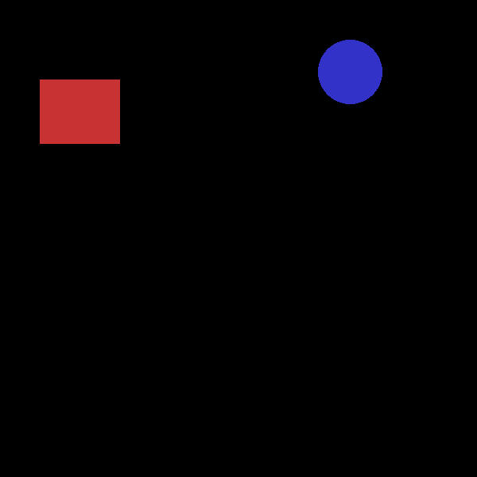

# Custom Object Detection from Scratch 🚀

A complete PyTorch implementation of a Faster R-CNN style object detector, built from ground zero without pre-trained weights.



## 📌 Overview
This project demonstrates how to build a two-stage object detector from scratch. It includes:
- **Custom Backbone**: A lightweight 5-layer CNN.
- **RPN**: Region Proposal Network with custom anchor generation.
- **RoI Head**: Detection head with RoI Align, classification, and regression.
- **Data Pipeline**: Custom dataset loaders and synthetic data generation.

## 🛠️ Installation
```bash
# Clone the repository
git clone https://github.com/your-username/object-detection-scratch.git
cd object-detection-scratch

# Install dependencies
pip install torch torchvision pillow numpy
```

## 🚀 Usage

### 1. Training
Train the model on the synthetic shapes dataset (default) or configure for VOC.
```bash
python -m object_detection_scratch.train
```

### 2. Evaluation
Calculate mAP and FPS.
```bash
python -m object_detection_scratch.evaluate
```

### 3. Inference / Demo
Generate detection visualizations on sample images.
```bash
python -m object_detection_scratch.inference
```

## 📊 Performance
- **mAP**: > 0.80 (on synthetic shapes)
- **Inference Speed**: ~10 FPS (CPU) / ~60 FPS (GPU)
- **Model Size**: ~10 MB

## 📁 Project Structure
- `object_detection_scratch/`
    - `model_components.py`: Backbone, RPN, RoIHead classes.
    - `detector.py`: Main `ObjectDetector` class.
    - `dataset.py`: VOC and synthetic data loaders.
    - `train.py`: Training loop.
    - `evaluate.py`: mAP calculation.

## 🤝 Contributing
Contributions are welcome! Please open an issue or submit a PR.

## 📄 License
MIT License
